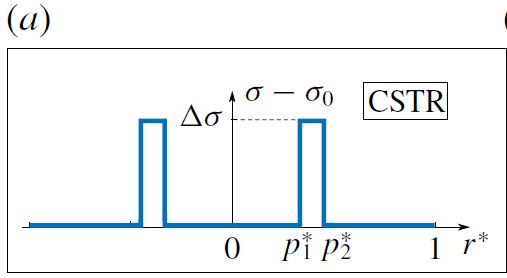

# Flow in droplet by surface tension
This project is the extension work of the paper published in JFM: [Marangoni circulation by UV light modulation on sessile drop for particle agglomeration](https://doi.org/10.1017/jfm.2019.373).

This project is used to calculate the Marangoni flow stream function as well as the velocity field in a spherical cap droplet of various contact angle based on Stokes flow assumption. **Streamlines** folder contains all the codes needed to calculate and plot stream function and folder **Velocity** contains codes calculating velocity field in droplet based on Spherical coordinates or Toroidal coordinates.

## Streamlines
For calculating the stream function and streamlines, run the main program ```GaussianTensionStreamFunction.m```. The main program calculate the stream function values at 100X100 nodes and return a ```*.mat``` file. Four different patterns of surface tension is considered and correspond ```N2(Gaussian).m```, ```N2(Step).m```, ```N2(MultipleGaussian).m``` and ```N2(Concentric).m```, which are discribed below:

### Gaussian


### Step


### Concentric


### MultipleGaussian


When using the code for calculation, the proper ```N2(***).m``` should be picked and suitable modifications should be made to match the surface tension profile one is dealing with, and rename it to ```N2.m``` to overwrite the original ```N2.m``` file.

Note that ```PSI.m``` file implements parallel computing by calling ```spmd()``` in matalbe. One should also change the value of *nodes* to match the number of CPUs used in the calculation. The number of CPUs should also be put in the main program in ```parpool($number of CPUs)```.

The **Streamlines** folder also contains 2 codes for ploting streamlines. ```StreamFunctionPlot.m``` create a draft plot for adjusting the contour value list and ```StreamFunctionPlot_Final.m``` plots the refined contour.

A sample result is also included in this folder as ```StreamFunction_b37.8_s200_p0.2_t900.mat```.

## Velocity
For calculating the velocity field in droplet, either Spherical coordinates (folder **Velocity_by_Spherical_Coordinates**) or Toroidal coordinates (folder **Velocity_by_Toroidal_Coordinates**) can be used. The patterns of surface tension considered are same as the four patterns discribe in **Streamlines**, thus, the modification for ```N2.m``` is exactly the same as in streamline calculation. Parallel computing is also implemented for velocity calculation:

### In Spherical coordinates
The main program is ```Velocity_of_Spherical_Coordinate.m```.

```dpsid.m``` needs to be modified for *nodes* value to match the number of CPUs used.
### In Toroidal coordinates
The main program is ```VelocityInToroidalCoordinates.m```.

```Ualpha1.m```, ```Ualpha2.m```, ```Ubeta1.m``` and ```Ubeta2.m``` need to be modified for *nodes* value to match the number of CPUs used.
