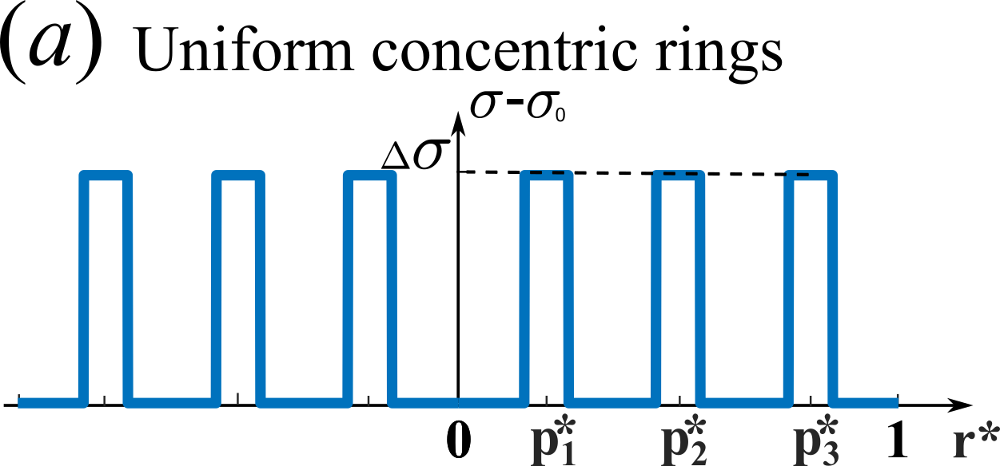
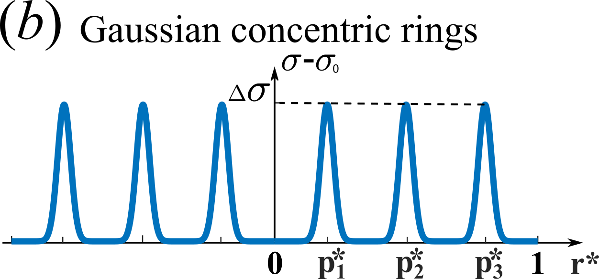

# Flow in droplet by surface tension
This project is the extension work of the paper published in JFM: [Marangoni circulation by UV light modulation on sessile drop for particle agglomeration](https://doi.org/10.1017/jfm.2019.373).

This project is used to calculate the Marangoni flow stream function as well as the velocity field in a spherical cap droplet of various contact angle based on Stokes flow assumption. **Streamlines** folder contains all the codes needed to calculate and plot stream function and folder **Velocity** contains codes calculating velocity field in droplet based on Spherical coordinates or Toroidal coordinates.

## Streamlines
For calculating the stream function and streamlines, four different patterns of surface tension is considered and correspond to ```N2(Gaussian).m```, ```N2(Step).m```, ```N2(MultipleGaussian).m``` and ```N2(Concentric).m```, which are discribed below:

### Gaussian


### Step


### Concentric
The codes in **Concentric** folder are used to find stream function field for a concentric surface tension distribution as shown below.



### MultipleGaussian
The codes in **MultipleGuassian** folder are used to find stream function field for multiple Gaussian surface tension distribution as shown below.



### Plot
This folder contains 2 codes for ploting streamlines. ```StreamFunctionPlot.m``` create a draft plot for adjusting the contour value list and ```StreamFunctionPlot_Final.m``` plots the refined contour. A sample result is also included in this folder as ```StreamFunction_b37.8_s200_p0.2_t900.mat``` for checking these plot codes.
