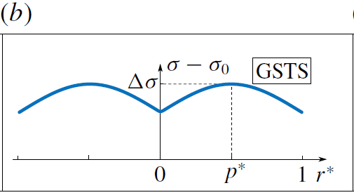

# Flow in droplet by surface tension
This project is the extension work of the paper published in JFM: [Marangoni circulation by UV light modulation on sessile drop for particle agglomeration](https://doi.org/10.1017/jfm.2019.373).

This project is used to calculate the Marangoni flow stream function as well as the velocity field in a spherical cap droplet of various contact angle based on Stokes flow assumption. **Streamlines** folder contains all the codes needed to calculate and plot stream function and folder **Velocity** contains codes calculating velocity field in droplet based on Spherical coordinates or Toroidal coordinates.

## Streamlines
For calculating the stream function and streamlines, four different patterns of surface tension is considered and correspond ```N2(Gaussian).m```, ```N2(Step).m```, ```N2(MultipleGaussian).m``` and ```N2(Concentric).m```, which are discribed below:

### Gaussian


### Step


### Concentric


### MultipleGaussian


When using the code for calculation, the proper ```N2(***).m``` should be picked and suitable modifications should be made to match the surface tension profile one is dealing with, and rename it to ```N2.m``` to overwrite the original ```N2.m``` file.

Note that ```PSI.m``` file implements parallel computing by calling ```spmd()``` in matalbe. One should also change the value of *nodes* to match the number of CPUs used in the calculation.

The **Streamlines** folder also contains 2 codes for ploting streamlines. ```StreamFunctionPlot.m``` create a draft plot for adjusting the contour value list and ```StreamFunctionPlot_Final.m``` plots the refined contour.

A sample result is also included in this folder as ```StreamFunction_b37.8_s200_p0.2_t900.mat```.

## Velocity
For calculating the velocity field in droplet, 
